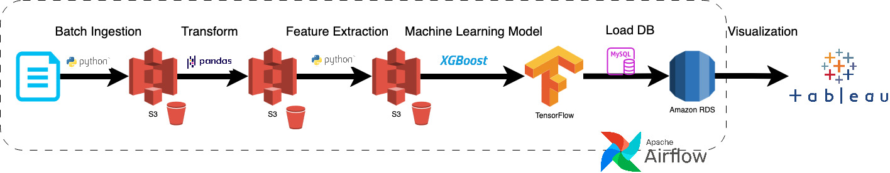
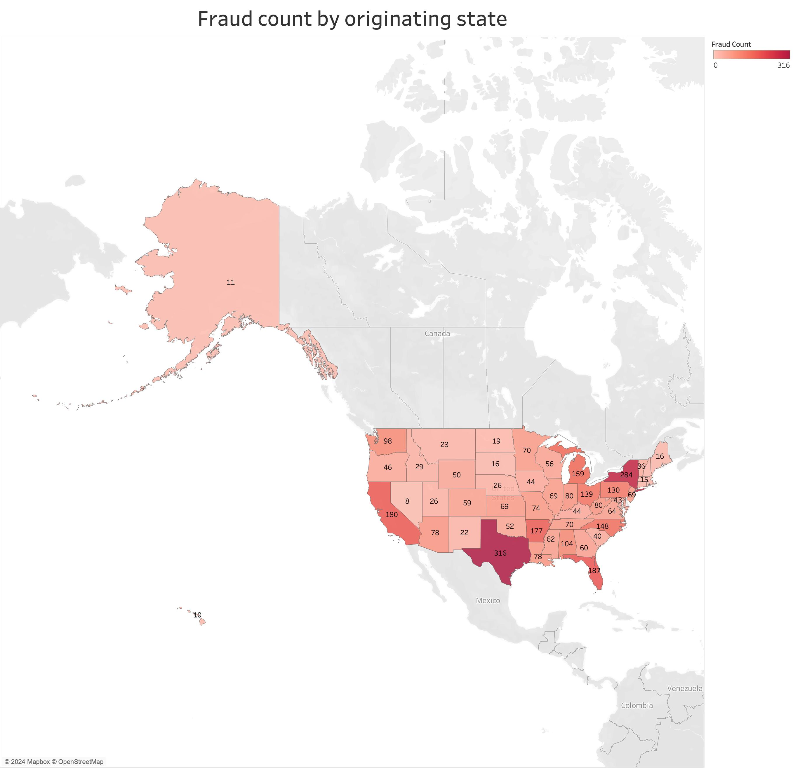
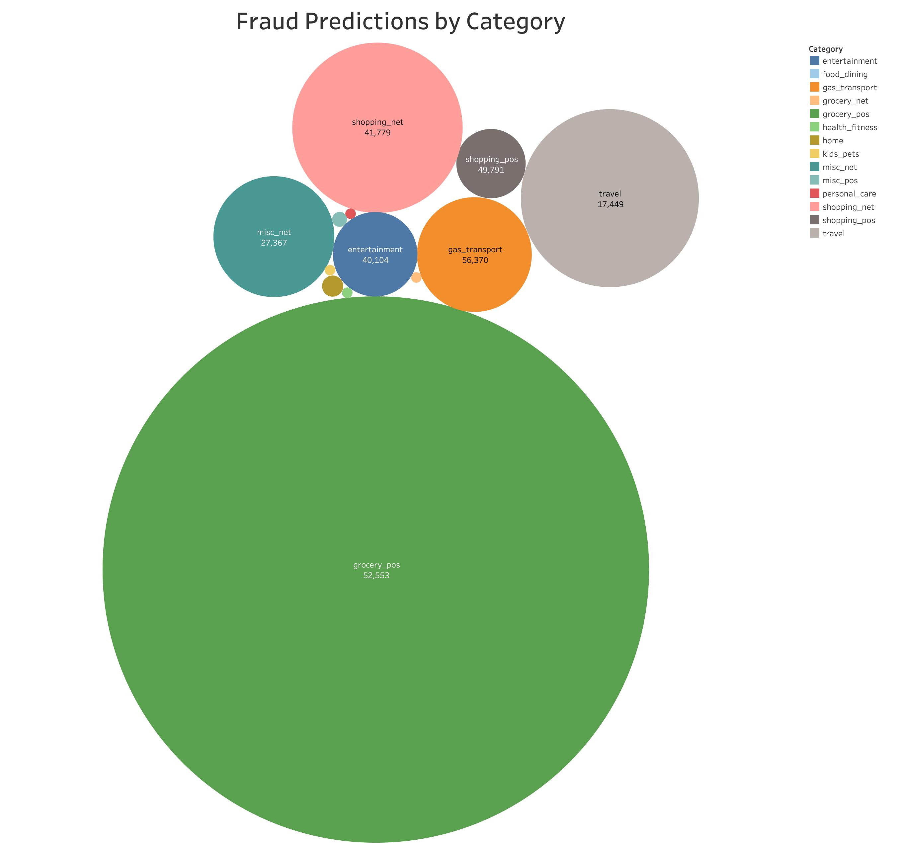
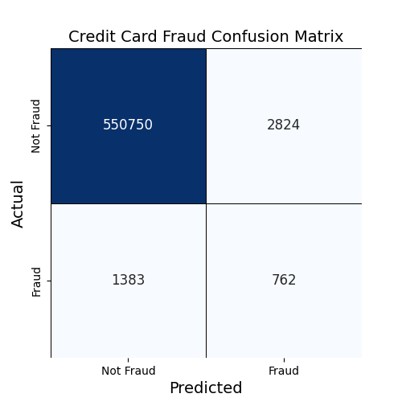
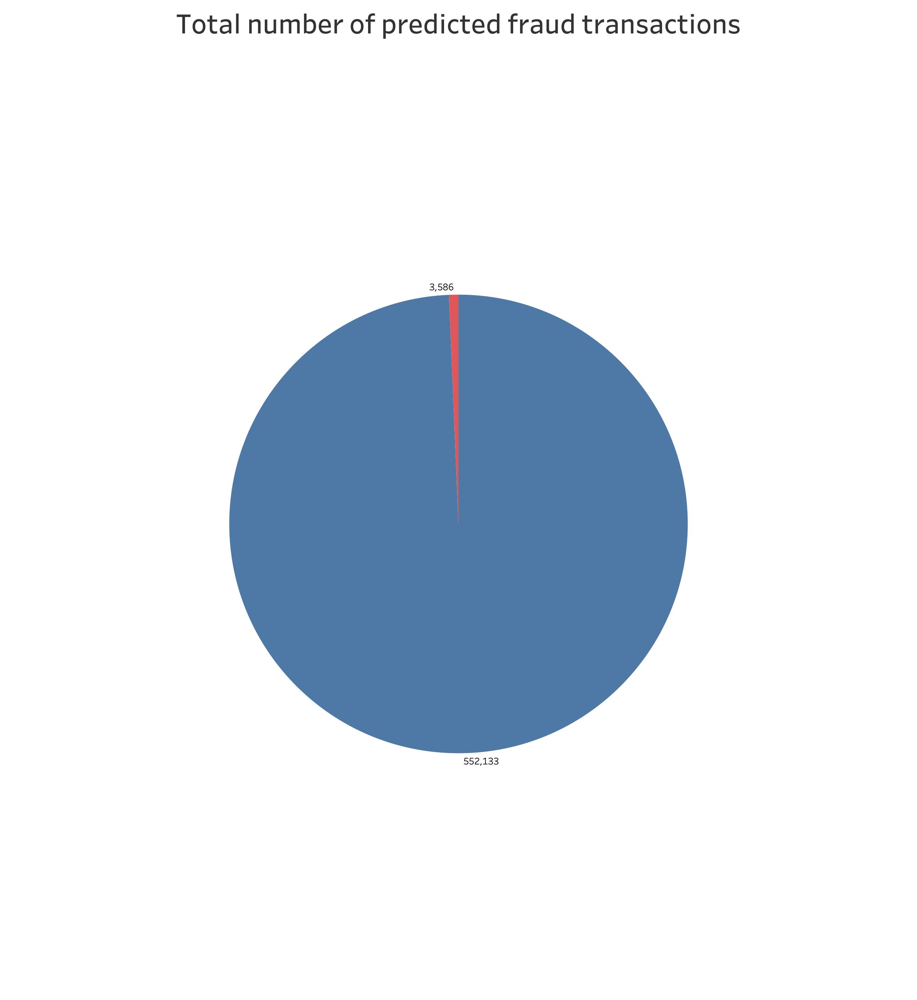

# Credit Card Fraud Detection ML Pipeline

A cloud data pipeline utilizing machine learning to predict credit card fraud!

###### November 13 2024
## Description

### Objective

Credit Card fraud loss is in the billions of dollars. This project is an automated method to detect fraudulent activities from credit card data. Without rapid detection, proper response, mitigation, and damage are all at risk. The pipeline, discussed in detail later, will show that machine learning tools can rapidly detect and inform us of fraudulent activities and then present them in a human consumable form.

### Dataset

I use a synthetic dataset generated by the Sparkov Data Generation tool by Brandon Harris. The tool was used by Kartik Shenoy and uploaded to [**Kaggle**](www.kaggle.com/datasets/kartik2112/fraud-detection) where you can read more about its creation.

### Data Quality
The data is trustworthy as its origins can be traced back to the original simulator. Because this data is simulated, there is not much impetus to authenticate the data. Other than being available from a widely well know dataset library, Kaggle, the data itself is not signed, encrypted, include checksums or authenticated in any way. For our purposes, this is not a great concern. 

Exploratory data analysis (EDA) was conducted (See [EDA.py](EDA.py)) locally to aid in selecting the appropriate features.
### Tools & Technologies

- Cloud - [**Amazon Web Services**](https://aws.amazon.com/)
- Containerization - [**Docker**](https://www.docker.com)
- Orchestration - [**Airflow**](https://airflow.apache.org)
- Data Lake - [**AWS S3**](https://aws.amazon.com/s3/)
- Data Warehouse - [**AWS S3**](https://aws.amazon.com/s3/)
- Data Visualization - [**Tableau**](https://www.tableau.com/)
- Language - [**Python (v3.8.10)**](https://www.python.org)
  - Libraries
    - pandas-datareader (v0.10.0)
    - scikit-learn (v1.3.2)
    - tensorflow (v2.13.1)
    - pymysql (v1.1.1)
    - xgboost (v2.1.2)

### Architecture
There are five major steps in the pipeline depicted below. Lastly, I load the data into Tableau for some analysis and visualization. Plots can be found in [AnalysisResults](AnalysisResults) 

### Prediction Graphs

## Setup

### Pre-requisites

You will require some infrastructure resources
- Cloud - [**Amazon Web Services**](https://aws.amazon.com/)
  - EC2 Instance
  - S3 Bucket access

Your EC2 Image should have the below tools installed for use of the DAG in this project
- [**Airflow**](https://airflow.apache.org)
- [**Python (v3.8.10)**](https://www.python.org)

### Get Going!
Once you have the EC2 instance installed with Airflow and Python, ensure you install the required python libraries
 - pip install pandas-datareader 
 - pip install -U scikit-learn 
 - pip install tensorflow 
 - pip install pymysql 
 - pip install xgboost

Then simply copy the contents of this repo to your airflow/dags folder, and run the "batch_ingest_dag" DAG. You should see a pipeline of 5 steps. 

## Final Thoughts

### Result
The time-series data were Jan 1 2019 – June 21 2020 and June 21 2020 – Dec 31 2020 for the train and test datasets respectively, so there is no need for splitting the dataset for our ML model. The only transformation needed is to add the column name to the first column, Row Number, as it is used to relate the test data back to the prediction. During feature extraction, I chose to use the credit card number, amount and time as scalars, converted to be between 0 and 1 for training efficiency. I choose the merchant, category and gender columns, encoded to an enum as well.

The XGBoost model was trained and resulted in a 99.25% accuracy but a 67.50% AUC-ROC score. The confusion matrix for the test dataset is shown below.

The AUC-ROC score and confusion matrix show that this model, while highly accurate has a significant number of false negatives and an even higher number of false positives. The model shows promise in detecting fraud cases, but has a high number of incorrectly classified cases. An end user would need to use this data carefully, and validate the results before taking action. It is comforting to know, as seen below, that the number of fraud cases in general are small, and should be accessed with individual business's data to determining the level of effort that should be spent on this type of technology.

### How can I make this better?!
 Future improvements include:
 - Testing better ML algorithms to increase the ROC score > 95%
 - Creating an interactive UI with something like Data Studio
 - Have realtime streaming data feed into a constantly running process
 - Create a resilient and redundant set of infrastructure for fail-safe
 - Create and generate automate alerts via SMS/Email to the end user (this will require collecting some PII)
 - Add CI/CI for developers
 - Create a standalone docker container with all the pre-reqs to make this portable
 - Standardize an input API for the dataset

